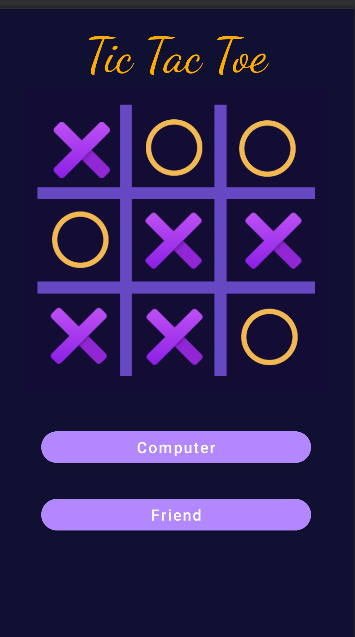
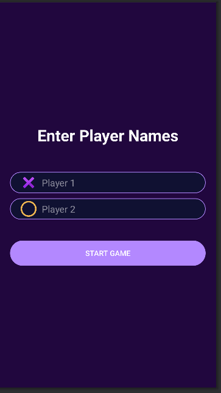
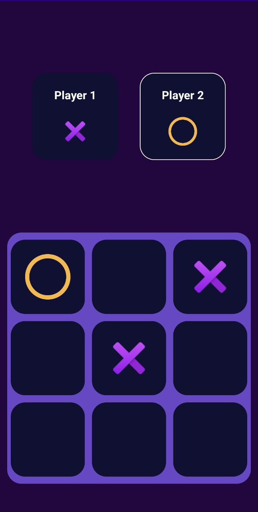

# Tic Tac Toe

This is a *Tic Tac Toe* android app, developed by me in my first year of learning android development. 

## Preview
This app is build with Java and Kotlin in Android Studio.
You will find some basic features after the app launches. You are free to choose between two different play modes (Computer mode  is launching soon).
In Multiplayer Mode, you can enter players names. Explore more features by yourself! 

<!--  -->
<!-- HTML -->

## How to Run

You will need Android Studio 2022.1.1 Patch 1 or above.

- Download the ZIP from the gitHub page and unzip it.
- Open Android Studio.
- Click on the OPEN button and select the unziped folder.
- Click on Trust project if asked to.
- Wait for gradle to download necessary packages.
- Select your Emulator and click on Run app button.
- Enjoy!

## Installation
- Download the latest apk version from the Release (gitHub Repository).
- Allow your android device to install from the unknown source if not allowed.
- Find the app in the app drawer of your android device.
- Enjoy!

## Future Plans

- Versus Computer Mode
- Visual improvements
- implimanting AI TO add three difficulty mode.
- Your ongoing games will be automatically saved, so you can resume playing right from where you left off.
